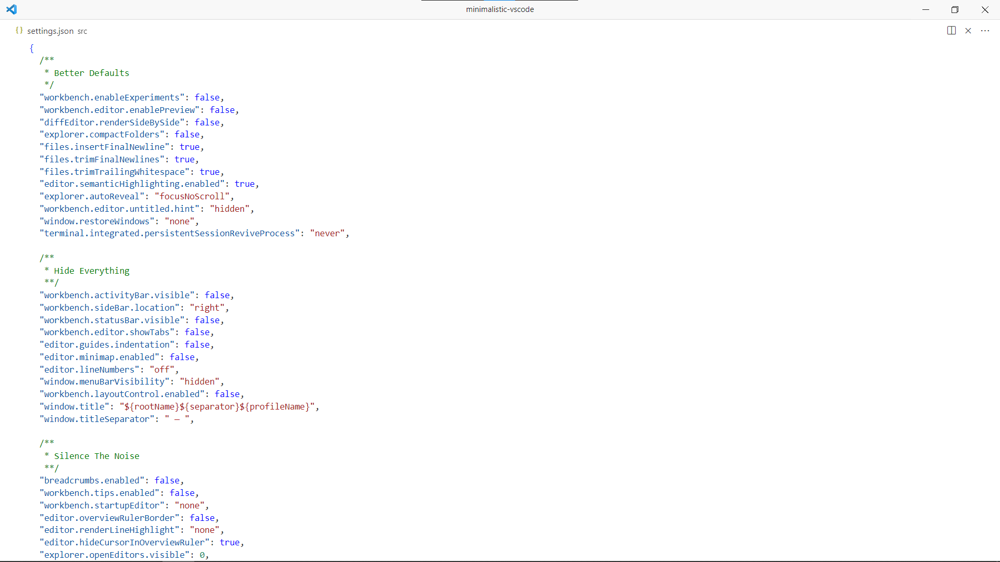
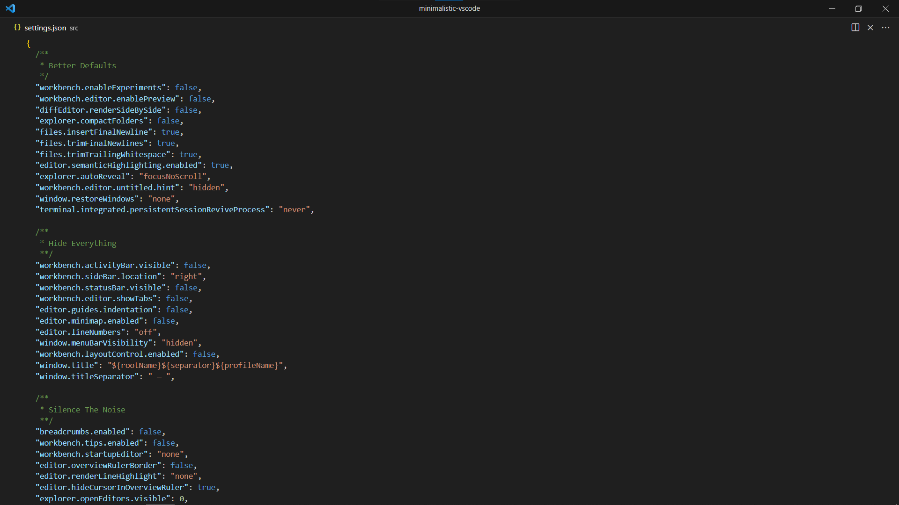
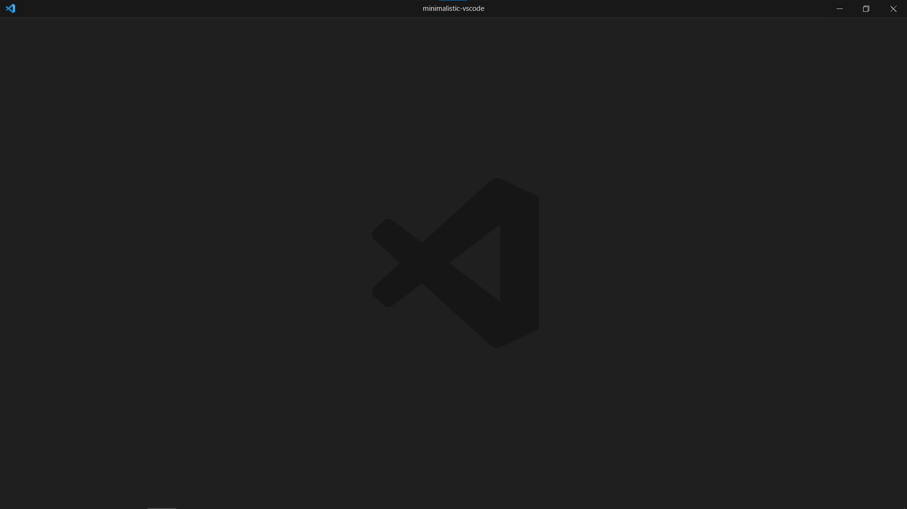

  
  

# Minimalistic VSCode

This is a list of things I do when setting up VSCode from scratch. I prefer a clean and minimalistic
look. It's focused on minimizing distractions, reducing mouse usage and optimizing the overall
workflow.

## Installation

Copy the contents of [`src/settings.json`](src/settings.json) to your settings file (search
**Preferences: Open Settings (JSON)** using the Command Palette).

## Screenshots

